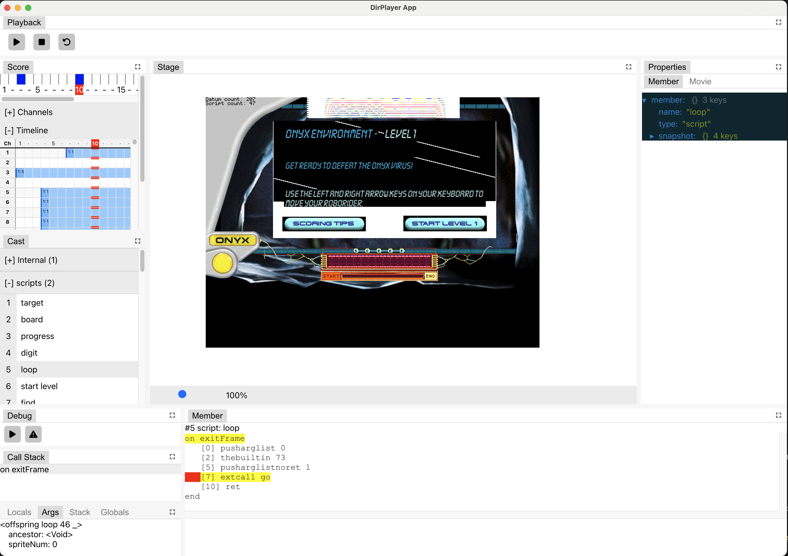

# DirPlayer

DirPlayer is a Shockwave Player emulator written in Rust that aims to make playing old browser games possible on modern browsers.

## Demo

Check out a live demo of this project at http://dirplayer-rs.s3-website-us-west-2.amazonaws.com/

## Chrome Extension

Download the Chrome Extension at https://chromewebstore.google.com/detail/dirplayer-shockwave-emula/gpgalkgegfekkmaknocegonkakahkhbc

The extension implements a polyfill that replaces all `<embed>` elements that point to a Shockwave file in websites you visit.

## Standalone App

Alongside the emulator, DirPlayer comes with a standalone application that provides a complete debugging toolset for Lingo scripts and Shockwave files.

Pre-built binaries can be found at https://github.com/igorlira/dirplayer-rs/releases



## Requirements
- NodeJS
- - [(LTS or newer)](https://nodejs.org/)
- RustLang
- - [(1.70.0 or newer)](https://www.rust-lang.org/)
- wasm-pack
- - https://github.com/rustwasm/wasm-pack/releases

## Building
> [!NOTE]  
> Before we can start, we need to load the missing modules for NodeJS with the `npm install` command.

### 🪟 Windows
Windows users can use our scripts which are located in the [`scripts`](https://github.com/igorlira/dirplayer-rs/tree/main/scripts) folder and end with `.bat`.
- Build Rust VM with [`scripts/build-vm.bat`](https://github.com/igorlira/dirplayer-rs/blob/main/scripts/build-vm.bat)
- Build extension with [`scripts/build-extension.bat`](https://github.com/igorlira/dirplayer-rs/blob/main/scripts/build-extension.bat)
  - [Further information can be found here](https://github.com/igorlira/dirplayer-rs?tab=readme-ov-file#building-extension)
- Run locally with [`scripts/run.bat`](https://github.com/igorlira/dirplayer-rs/blob/main/scripts/run.bat)

### 🐧 Other platforms
#### Building Rust VM

```bash
npm run build-vm
```

#### Building extension

```bash
npm run build-extension
```

Make sure to build the VM first. The bundled extension will be located in `./dist-extension`. 

You can install the local build by going to `chrome://extensions`, enabling Developer Mode, then clicking the `Load unpacked` button.

Note that the extension is currently only available on Chrome.

#### Building standalone app

Make sure to build the VM before building the standalone app. The build will be located in `./dist`.

```bash
npm run electron-pack
```

#### Running locally

```bash
npm run start
```

#### Running standalone app locally

```bash
npm run electron-dev
```

## Join our Discord!

If you have any questions or you're interested in being part of the discussions of this project, please join our Discord!

https://discord.gg/8yKDk9nJH2

## Acknowledgements

This project would have not been possible without the extensive work of the Shockwave reverse engineering community.

A lot of code has been reproduced from the following projects:

https://github.com/Earthquake-Project/Format-Documentation/

https://github.com/Brian151/OpenShockwave/

https://gist.github.com/MrBrax/1f3ae06c9320863f1d7b79b988c03e60

https://www.scummvm.org/

https://github.com/csnover/earthquake-rust/

https://github.com/ProjectorRays/ProjectorRays
